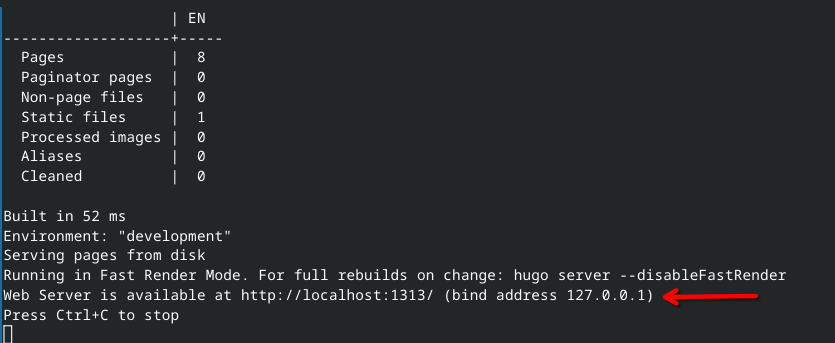
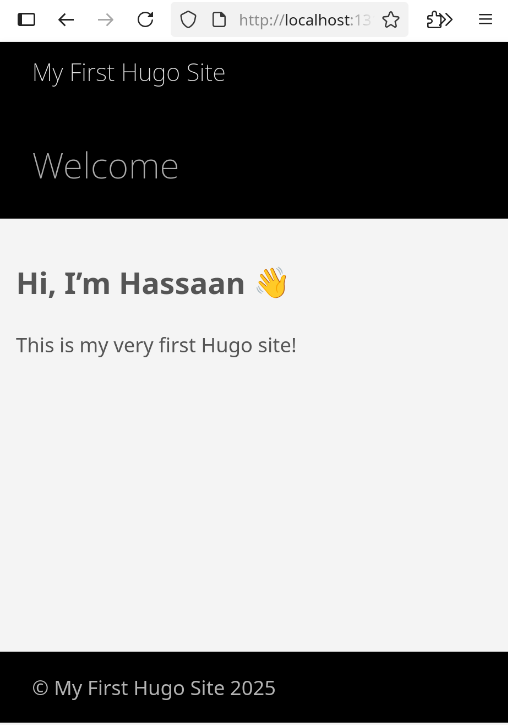

# 3. Hugo Fundamentals

Now that you're comfortable with Markdown, it's time to learn about **Hugo**, the static site generator that will power your website. Hugo takes your Markdown content and turns it into a full-featured website — quickly and efficiently.

---

## 3.1 Introduction to Hugo

### 3.1.1 What is a Static Site Generator?
---

A **Static Site Generator (SSG)** is a tool that builds complete HTML pages from raw content (like Markdown) and templates. Instead of writing every page manually in HTML, you write your content once and let the SSG do the heavy lifting.

**Hugo** is:

- Open-source
- Blazingly fast (one of the fastest SSGs)
- Written in Go
- Ideal for blogs, portfolios, documentation, and more

### 3.1.2 Installing Hugo

---

To install Hugo, use your package manager to download, or download from the [Hugo Releases Page](https://github.com/gohugoio/hugo/releases).

You can now verify the installation in your shell with: 

``` bash
hugo version
```

### 3.1.3 Hugo Folder Structure

---

Once you create a site, Hugo gives you a folder layout like this:

``` tree
my-site/
├── content/       ← Markdown pages go here
├── layouts/       ← Custom templates
├── static/        ← Images, CSS, JS (served as-is)
├── themes/        ← Themes (if used)
├── config.toml    ← Site configuration
└── public/        ← Final built site (after `hugo` command)
```

Each folder has a purpose. Understanding this structure will help you stay organized as your project grows.

## 3.2 Customizing a site

Let's go hands-on and create your first Hugo site!


### 3.2.1 Content vs Layouts vs Static

---

Just as a reminder, here are the main 3 fodlers that you will be working on.

* `content/` : Your Markdown pages live here. Hugo will turn these into HTML pages.
* `layouts/` : Custom HTML templates. You can use these to cahnge how pages look, but most templates are already refined.
* `static/` : Anything in here (images, fonts, custom CSS) is copied directly to the final site. 

This separation keeps your project clean and maintainable.

### 3.2.2 Themes - Choosing and Installing

---

Hugo uses themes to define the look and feel of your site. Themes control layout, design and often include built-in templates.

To get a theme:

1. Visit https://themes.gohugo.io
2. Pick a beginner-friendly template (for example : [Coder](https://themes.gohugo.io/themes/hugo-coder/))
3. Install it as a [Git submodule](https://www.geeksforgeeks.org/git-submodule/) (we will see how later in this tutorial)

You would then need to set it as your theme in the configurations.

1. Open your config file in `hugo.toml`
2. Add this line in theme:
``` toml
theme = "anake"
```

There you go. Your theme is set.

### 3.2.3 Hugo Templates (Where and How)

---

Templates in Hugo are like blueprints for your content. You don’t need to write them from scratch (yet), but you should know that themes already include templates for:
* Home pages
* Posts
* Lists
* Individuals pages

However, if needed be, you can override these by placing custom templates in `layouts/`.

**Where to find templates**:
* Inside the theme's `layouts/` folder
* On the [Hugo docs](https://gohugo.io/templates/)
* GitHub

It is more practical to use already-made templates, not build them from scratch.

### 3.2.4 Edit Contect Using Markdown

---

Okay, now is time to learn to edit the actual content. Like mentionned before, all of the content is located in the `content/` folder, in Markdown format.

All you need to do is open a file, edit it the way you like it, and save it. Yes... As simple as that, that's the whole point, bud.

## 🧪 3.3 Mini Lab : Your First Custom Page.

The goal is to warm up by creating a Hugo site with a theme and personalizing it with your name.

This will also demonstrate you the workflow of creating a website.

### Step 1 - Create a new Hugo Site

Go to a local directory where you want to work on your website (create if needed).

Once you're in it, create the site (not run the server) with the `hugo new site [sitename]` command in shell.

Ex:

``` bash
hugo new site my-first-hugo-site
```

then head to that folder:

``` bash
cd ./my-first-hugo-site
```

!!! note "Remark"

    If you do the `tree ./` command, you will the hierarchy of directories in that folder, which is the same we showed earlier.

### Step 2 - Install the Coder theme

When you're installing a theme, that same theme can change over time. You want to be update with that theme, that's why we need to create what we call [submodule](https://www.geeksforgeeks.org/git-submodule/). You will be able to pull from the theme's GitHub repository. Let's do that now with the [Ananke theme](https://themes.gohugo.io/themes/gohugo-theme-ananke/):

``` bash
git init
git submodule add git@github.com:theNewDynamic/gohugo-theme-ananke.git themes/ananke
```

### Step 3 - Update your `hugo.toml`

Like mentionned earlier, when you add a theme to your website, you need to update your config file.

Open `hugo.toml` and edit the following lines:

``` toml
theme = "ananke"
# here you can also modify the title of your website
title = "My First Hugo Site"
```

### Step 4 - Create a homepage

Now, if you notice, there's nothing in the `content/` folder. Let's create a homepage with the `new` command:

``` bash
hugo new _index.md
```

### Step 5 - Edit the homepage

Open `_index.md` in `content/` (path = `content/_index.md`) and write the following:

``` markdown
---
title: "Welcome"
date: [date d'aujourd'hui]
---

## Hi, I’m [Your Name] 👋

This is my very first Hugo site!
```

Save it.

### Step 6 - Preview your site

To preview or run the server (on your computer in that case), we can use the `server` command:

```bash
hugo server
```

Open the page with that address in your webbrowser:




### Step 7 - Done :smile:

Here is the result:



Now we're ready to make **OUR PORTFOLIO**.