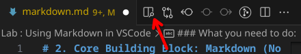

# 2. Core Building Block: Markdown (No HTML/CSS)

Before diving into Hugo, it’s essential to understand **Markdown** — the simple, lightweight syntax used to write content for static sites. Markdown is easy to learn and helps you focus on **writing**, not formatting.

---

## 2.1 Origin of Markdown and Its Usefulness

**Markdown** was created by John Gruber in 2004 with the goal of making writing for the web easy to read and easy to write.

Why Markdown?

- **Human-readable** syntax
- Converts easily to HTML
- Widely supported (GitHub, forums, blogs, CMS tools)
- Works seamlessly with Hugo

When you write content in Hugo, you’ll mostly write in Markdown — so it’s your first essential skill.

---

## 2.2 Basic Markdown Syntax

Here’s a quick reference of the most commonly used Markdown elements:

### Headings

``` markdown
# H1
## H2
### H3
```

### Emphasis

---

``` markdown
*italic* or _italic_
**bold** or __bold__
```

### Inline Code

---

You can use the ` character to insert line of code within a line of text.

Ex:

``` markdown
This is normal C arithmetic `c+=1;`.
```
Would be displayed like this:
This is normal C arithmetic `c+=1;`.

### Code block

---

You have to use ` ``` ` for opening and closing a code block. You can also specifiy which language it contains after the ` ``` `.

Example:

``` markdown
    ``` go
        package main

        import "ftm"

        func greet(){
            ftm.Println("Hello World")
        }
    ```
```
Would be displayed like this:

``` go
        package main

        import "ftm"

        func greet(){
            tm.Println("Hello World")
        }
```
### Lists

---

You can use `*` or `-` with a space afterwards to insert a list item.

Ex:

``` markdown
    * Item 1
    * Item 2
    * Item 3
```

Would be displayed like this:

* Item 1
* Item 2
* Item 3

You can also create nested list by entering a tab to go a level deeper.

Ex:

``` markdown
* Item 1
    * Item 1.1
        * Item 1.1.1
    * Item 1.2
* Item 2
```
Would be displayed like this:

* Item 1
    * Item 1.1
        * Item 1.1.1
    * Item 1.2
* Item 2

### Links

---

You redirect the user to a certain website by clicking on a word.

It follows this format: ` [link_label](url)`.

Ex:

``` markdown
 Here is a link to [Youtube](youtube.com)!
```

Would be displayed like this:

Here is a link to [Youtube](https://www.youtube.com/watch?v=dQw4w9WgXcQ)!

!!! tip "Try it"

    Try clicking on the link, it actually works!

??? note "Note"

    gotcha :smile:

### Images

--- 

Images follow a similar format to links: ` `

!!! warning "Be careful"

    The exclamation point `!` before the brackets is required! Otherwise it won't displayed and your rendering might break.

Ex:

``` markdown
    
```

Will be displayed like this:


(I swear this is the last item I'm rickrolling you, dear reader - Hassaan)

### Blockquotes

---

Blockquotes are used to highlight a specific phrase, like a quote from someone.

Ex:

``` markdown
> There's no stranger to loooooove. You know the rules, and so do IIIIIIIIII.
```

Will be rendered like this:

> There's no stranger to looooove.You know the rules, and so do IIIIIIIIII.

-Rick Astley 

### Tables

---

Now, in my honest opinion, tables are not Markdown's strong point. They are only useful when you want a table that never changes (or RARELY changes - like once in a Moon). Otherwise, don't bother.

Ex:

``` markdown
| Method      | Description                          |
| ----------- | ------------------------------------ |
| `GET`       | :material-check:     Fetch resource  |
| `PUT`       | :material-check-all: Update resource |
| `DELETE`    | :material-close:     Delete resource |
```

Will be displayed like this:

| Method      | Description                          |
| ----------- | ------------------------------------ |
| `GET`       | :material-check:     Fetch resource  |
| `PUT`       | :material-check-all: Update resource |
| `DELETE`    | :material-close:     Delete resource |


## 2.3 GitHub Markdown

GitHub uses a slightly extended flavor of Markdown known as GitHub Flavored Markdown (GFM).

Additional features include:

* Task lists:

``` markdown
- [ ] Done
- [ ] To-do
```

Autolinked URLs:
Just type https://github.com — no brackets needed.

## 2.4 Small Lab : Using Markdown in VSCode

### Setup

1. Install [Visual Studio Code](https://www.youtube.com/watch?v=dQw4w9WgXcQ)
2. Install the extension: `markdownlint`
3. Create a new file: `my-first-markdown.md`

### Write the following:

``` markdown
# My First Markdown Page

## About Me

## Things I like

## A Code Sample

```

### What you need to do:

1. Write a small phrase about you. Put a word into **bold** and another in *italic* in the `## About Me` section.
2. Write a small list of things you like in `## Things I like`.
3. Put a small code block in `## A Code Sample`.
4. Add a new section (heading) called `My Quote`
5. Add a quote in that new section.
6. Add a subsection (heading) in `My Quote`, call it `My Link`.
7. Add a link in that subsection (please don't RickRoll me :sad:).
8. Get a preview in VSCode by clicking on the following icon:


Here you go!

## Conclusion

Now that you're confident writing in Markdown, you're ready to bring your content to life with **Hugo** — your static site generator. Up next: **Hugo Fundamentals**.